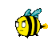
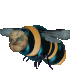
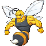
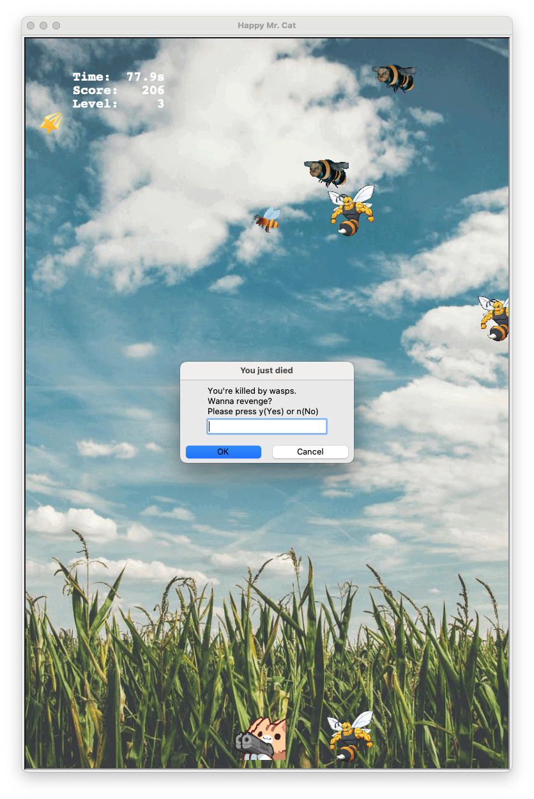

You are Happy Mr. Cat, working on your field, but there's a swarm of wasps charging at you for no reason. 

But, fortunately, you have a laser gun at your hand. Now, defend yourself against those insects!

# How to run it
``` $ python3 little_wasps.py ```


# Use the arrow keys to navigate the laser pistol and space to shoot
-  ←: move left 
- →: move right 
- Space: Shoot 
- Q: quit 

# The Happy Mr. Cat and his mini pals

- : The protagonist, Happy Mr. Cat, who loves farming and beautiful sunny day.

- : Happy Mr. Cat's mini pal. Well, who can say no to such innocent kittens.

# Wasps
- : Wasp Errand Boy, 1 pt
- : Wasp Troublemaker. 2 pts
- : Wasp Daredevil, 3 pts
- : Wasp Champion, 4 pts

# Drop Items

All wasps have 10% dropping rate for the following items. The items listed last for 5 sec.

- : Mini pals item can summon two mini cat pals for Happy Mr. Cat.

- : this item empowers the laser to go through any wasps without dissipate. 

- : this item enable the laser gun to generate another 2 beams of laser with an angle.

- : THE BOMB eliminates all the wasps at once.


# Troubleshooting:
IF Python cannot import tkinter correct, indicating 

    "If this fails your Python may not be configured for Tk", 

Try using the following

 ```   $ brew install python-tk```

# Gameplay screenshots
